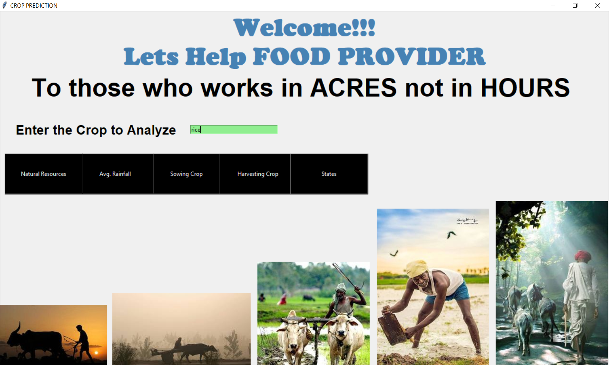
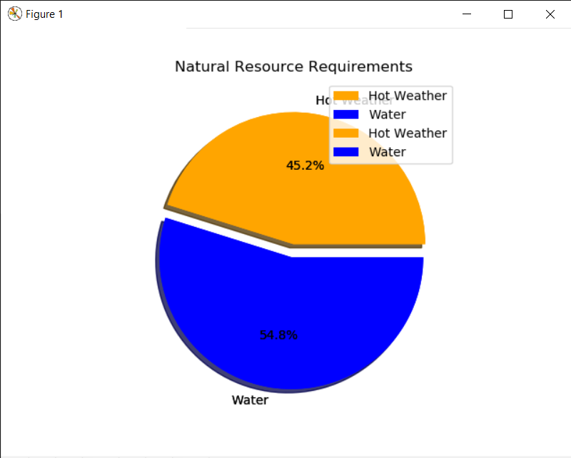
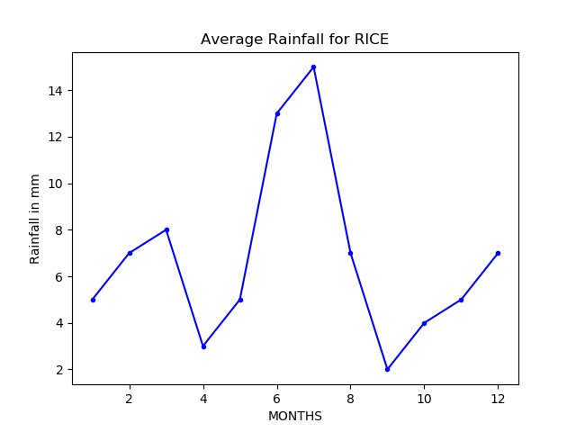
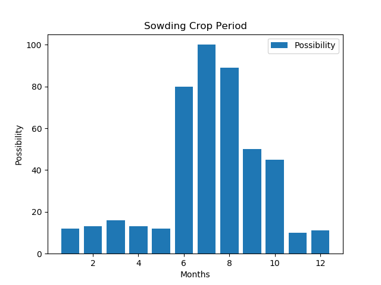

CropThesis:Crop analysis

My 5th semester miniproject 
 
I've used TkInter for GUI ,Pnadas and NumPy for Statistical Analysis and graphs
 
 
 This desktop application fetch data from inbuilt records i.e CSV Files and generate charts and graphs
 
  

     
     
  

<a href="https://vishalkk.github.io/">Take a look of my Website </a>
    
